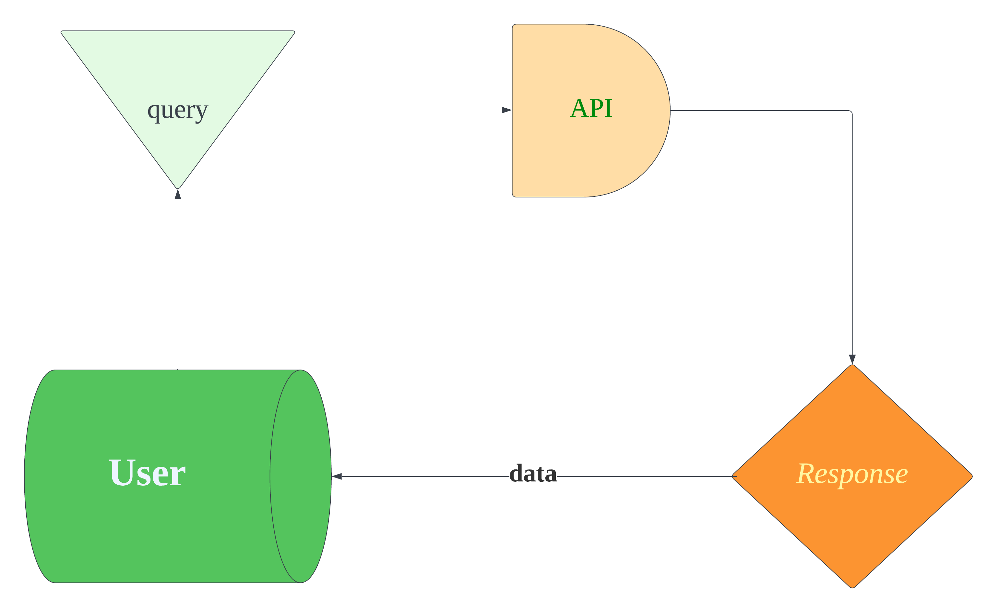

# City Explorer

## Deployed at:

The City Explorer Project was designed to allow users to search for location data for their favorite cities around the world                     .

## Day 1: Asynchronous code, and APIs

- Created Repos and setup Api and access tokens

## Name of feature: *City Entry Form*

Estimate of time needed to complete: 1.5

Start time: 6:15

Finish time: 10:30

Actual time needed to complete: 4:15

## Name of feature: *Error Modal*

Estimate of time needed to complete: 1.5

Start time: 12 pm

Finish time: 2pm

Actual time needed to complete: 2 hours

